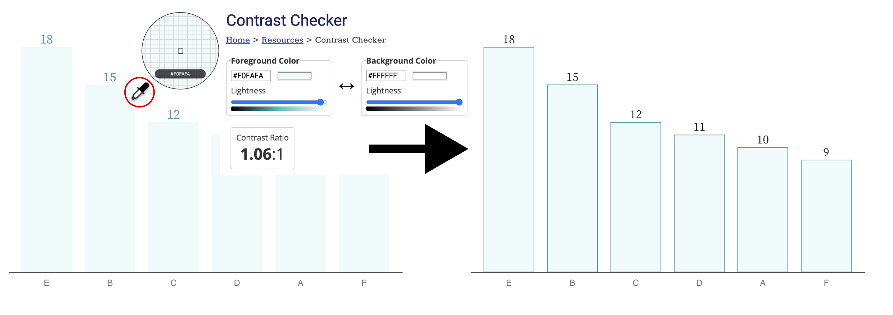
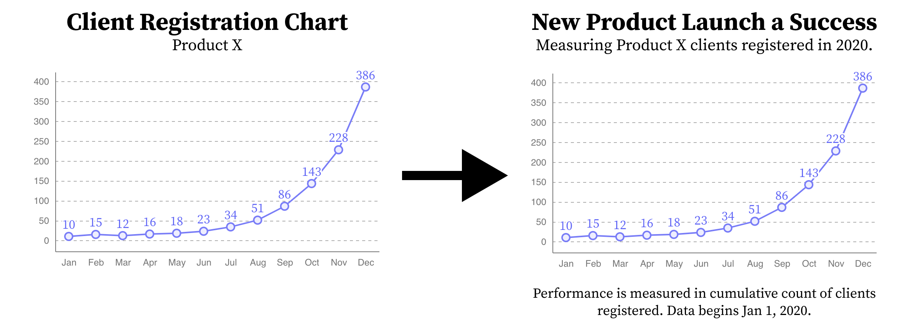
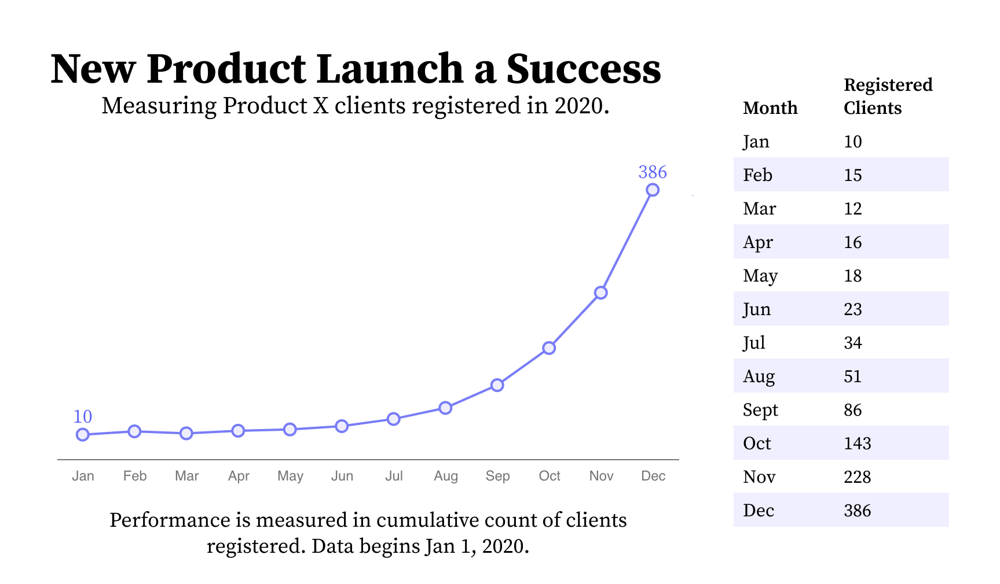

# The Chartability Workbook

This workbook is intended to serve as a lightweight, high-level audit for catching data experience* design failures related to accessibility. For more on Chartability, see our home page: [https://chartability.fizz.studio/](https://chartability.fizz.studio/)

*A data experience (DX) could refer to a data visualization such as a chart, graph, or plot, a “bespoke” (highly customized) graphic based on data, a model, or an algorithm, or a data driven interface or system.

## Method

This workbook organizes tests into seven categories, four of which are based on broad accessibility principles: Perceivable, Operable, Understandable, and Robust (POUR). The last three extend Robust: Compromising, Assistive, and Flexible (CAF).

An auditor should proceed through each test and determine whether the content fails or succeeds using techniques provided or their own methodology. The auditor should assume failure when tests are inconclusive and (if early in the design process) a proven pass to a future consideration has not yet been demonstrated.

## Failures

Unlike a compliance audit (which determines adherence to regulatory guidelines), Chartability is meant to identify design failures. Generally, Chartability approaches accessibility as a scale rather than a state: how accessible a DX is is determined by how few failures it contains. It should be assumed that even the absolute best DX may contain several failures, even after remediation. Note that Chartability should never be used in place of a compliance audit but always in tandem with it.

Chartability’s insistence on a scale (instead of a state) of accessibility requires that designers and creators consider their choices carefully: they must be willing to argue that lack of scope, time, or research or perhaps a unique consideration led to a given failure. No failure should be left unconsidered.

## Outcomes

Chartability is a set of heuristic tests that not only highlights failures for remediation, but also encourages healthy design critique and critical design discourse related to accessibility. Because excellence in accessibility is never a finished state, the outcome of a Chartability audit is less about arriving at accessibility and more about working towards an accessible experience.

A good audit is not about measuring sucess: a good audit finds evidence of risk and failure.

## What are "Critical" heuristics?

Some tests are considered _critical_ by members of the community because they are prohibitively expensive to fix, common, produces signficant barriers, and/or affect many aspects of a data experience design or development.

While all tests in Chartability are important, it is worth noting that Chartability's community has contributed to emphasizing the tests marked critical. All data experiences should strive to have 0 critical failures as a minimum while working toward 0 failures overall.

 

## How do you use Chartability?

There are a lot of different ways to perform an audit, and so there are also many different ways to use Chartability. Sometimes an audit is as casual as checking your work while you do it. And other times it is a big affair that involves teams of specialists and lawyers.

Realistically, while a highly trained auditor may be able to casually evaluate an artifact in as little as 30 minutes or even hold heuristics in mind as they are doing their own creative work, those new to auditing may take anywhere between 2 and 8 hours to complete a full pass of Chartability. Professional audits, which can take weeks or months, often include multiple auditors and provide rigorous documentation and detailed recommendations for remediation, typically in the form of a report. Chartability is meant to serve both quick pass and deep dive styles of audits, so users are expected to leverage it as they see fit.

Below we give an example of what might be a fast pass audit, using Chartability, in 5 steps. This isn't super thorough, but a good way to quickly check a handful of access barriers quickly.

### 1. Visual Testing

> Figure 1: A low contrast chart (left) compared to a higher contrast version (right). A dropper tool is extracting the fill color of the bar and then a contrast ratio has been calculated. Note that the fill color is the same on both bars, but darker borders have been added to ensure the visualization passes contrast tests.

Checking for contrast is the most common critical failure across all of our audits (88% of audits failed this heuristic). In order to evaluate contrast, often a combination of automatic (code-driven) and manual tooling is performed. When manually auditing, practitioners typically use a dropper and a contrast calculator (Figure 1). Contrast is measured by finding adjacent colors that are intended to convey meaning or boundaries, and finding a ratio between them. Standards require a different minimum contrast for text (4.5:1) than geometries like marks in a chart (3:1). Most auditors find this to be one of the easiest tasks to perform, but techniques can be tricky to handle. Testing for contrast accomplishes 3 different heuristics in Chartability: ensuring text/geometries have contrast, interactive states for elements have enough contrast change, and the keyboard focus indicator is easy to distinguish.

Perceivable heuristics also include tests and tools for color vision deficiency and ensuring that color alone isn't used to communicate meaning (like the redundantly encoded textures in Figure 8). And another common, critical failure from Perceivable is text size. No text should be smaller than 12px/9pt in size.

> Figure 2: Keyboard navigation paths on a stacked bar chart. The left shows a serial navigation example, typically just a default of rendering order. The right shows both groups (the stack of bars) and categories (the color/texture shared among bars across stacks) as dimensions to explore laterally or vertically.

### 2. Keyboard Probing

The next practice that most auditors should become comfortable with is using a keyboard to navigate and operate any functionality that is provided. Most assistive technologies, from screen readers to a variety of input devices (like switches, joysticks, sip and puffs, etc) use the keyboard api (or keyboard interface) to navigate content. If a data interface contains interactive elements (Figure 2, Figure 3), those elements (or their functionality) must be able to be reached and controlled using a keyboard alone. Auditors should be critical of how much work is involved in keyboard navigation, especially (Figure 7). All that is required to start is the auditor begins pressing the tab key to see if anything interactive comes into focus. Arrow keys, spacebar, enter, and escape may be used in some contexts. Generally, instructions or cues should always be provided.

> Figure 3: A mouse cursor is selecting a bar (left, shown with a thick indication border) in a stacked bar chart to filter a dataset (on the right). A system alert (red box) notifies the user of their interaction result. This selection capability must also be provided for the keyboard interface and the alert must be announced to screen readers.

Using a keyboard provides an opportunity to evaluate many different heuristics: checking for multiple inputs (Figure 3), whether the data structure that is rendered is navigable according to its structure (Figure 2), and whether keyboard navigability across all elements in a data interface is even necessary (Figure 7).

### 3. Screen Reader Inspecting

Closely related to keyboard testing is testing with a screen reader. Some things may work with a screen reader that do not with a keyboard (and vice versa), so both must be evaluated.

> Figure 4: Charts must have a visually available textual explanation provided that summarizes the outcome. "Client Registration Chart" for "Product X" (left) is inaccessible while "New Product Launch a Success" (right) gives a clear takeaway.

Screen readers, unlike more basic keyboard input devices, read out content that is textual (including non-visual textual information like alternative text). Using a screen reader to audit is generally the hardest skill to learn. Keeping this in mind, testing whether the meaningful text provided in a visual (such as in Figure 4) is accessible with a screen reader is the easiest and most basic test that auditors should first perform.

> Figure 5: An interactive chart displaying only "Image" as semantic information with no feedback provided on selection. The robust semantics given to a screen reader, "toggle button" (middle) as well instant feedback, "selected" (right) are considered proper semantics for an interactive experience.

Next, all valuable information and functionality in a data experience should tested whether it is available to a screen reader. This includes the individual variables about a mark as well as whether that mark is interactive (Figure 5), whether status updates that reflect context change provide alerts (Figure 3), and whether summary textual information is provided about the whole chart (Figure 4) as well as statistically and visually important areas of that chart (Figure 7).

> Figure 6: A line chart with a single line (left) and an accompanying data table (right). This line chart would not provide enough low-level information about each datapoint without the table provided. A table alone however would also be inaccessible. Providing both can satisfy conflicting accessibility needs for different audiences.

### 4. Checking Cognitive Barriers

First, auditing for cognitive barriers generally involves checking the reading level and clarity of all available text using analytical tools. But Chartability also requires that all charts have basic text provided that provides a visually-available textual description and takeaway (Figure 4). This alone is one of the most important things to check for. In complex cases where a chart has a visual feature with an assumedly obvious takeaway, checking for annotations or textual callouts is important to help avoid interpretive issues (Figure 7).

> Figure 7: A scatterplot with many points, where a single point within the chart can be accessed by a screen reader (left). Navigating this data piece by piece is unnecessarily tedious, so an annotation callout is provided to help the reader focus on an outlier cluster (right). The callout is being accessed by a screen reader, which is displaying the annotation’s summary as well.

### 5. Evaluating Context

The final series of checks an auditor should make involve thinking about the overall work in a design (as it intersects with other considerations) as well as the larger technical context where the user is situated.

Auditors should first try to change system settings (such as toggling high contrast modes) to see whether a data experience respects these settings (Figure 8), run automatic semantic evaluations as well as manually check for appropriate meaning (Figure 5), and check if dense or highly complex visuals have sonified, tactile, or textual summaries available (Figure 7). Auditors should also check whether system updates provide clear feedback textually (Figure 3) as well as checking if there are both high and low level representations of information available (Figure 6).

> Figure 8: A bar chart with categories (left) shown not conforming to Windows High Contrast White Mode. High contrast mode on Windows requires limiting color palettes, using only black or white for most elements (shown on the right).

Auditors should be especially critical of static designs, such as those where styling and presentation cannot change (like using textures by default or not, eg. Figure 8), which are a high risk of compromising and adaptive failure.

 

## The Tests

The following section contains Chartability's 7 principles and 50 heuristics, 14 of which are considered _critical_. Those new to chartability should try testing just the _critical_ heuristics first, and then move on to all of them.

## Perceivable

User must be able to easily identify content using their senses: sight, sound, and touch.

### __Low contrast__ _(critical)_

<i>(select to read more)</i>

_This heuristic is synthesized from standards_.

__Description__: Geometries and large text must have >3:1 contrast against background, Regular text must have >4.5:1.

__Good example__: [https://observablehq.com/@frankelavsky/high-contrast-for-data-visualization-with-examples](https://observablehq.com/@frankelavsky/high-contrast-for-data-visualization-with-examples)

__Example tools or testing method__: https://webaim.org/resources/contrastchecker/

__Cited standard__: [https://www.w3.org/WAI/WCAG21/Understanding/non-text-contrast.html](https://www.w3.org/WAI/WCAG21/Understanding/non-text-contrast.html)

<i>Notes (select to expand)</i>

Low contrast is the most common failure (88% of audits we have performed fail this). It also has the potential to be one of the most inclusive design spaces for representing data, perhaps outside of text treatment, content, and narrative design. Myndex Research (APCA/SPCA work) has noted the limitations of the WCAG 2.0/2.1 Model (which is based off of IEC/4WD 61966-2-1). The WCAG 3.0 Standard is likely to be much better, but work is still ongoing and not likely to become standard until at least 2025 or later.

 

### __Content is only visual__ _(critical)_

<i>(select to read more)</i>

_This heuristic is synthesized from standards_.

__Description__: Information in the chart must be available without visuals (no screen reader/braille support). At a minimum test using JAWS + Chrome, NVDA + Firefox (on Windows), VoiceOver + Safari (on Mac), and VoiceOver + Safari (on iOS). These devices must be able to access all chart information. All annotations, “visually apparent” trends or features, and all major narrative elements must be exposed to screen readers. Videos, presentations, and animations must include synchronized audio descriptions.

__Good example__: [https://youtu.be/w6ntxLG6MLQ](https://youtu.be/w6ntxLG6MLQ)

__Example tools or testing method__: https://support.apple.com/guide/voiceover/welcome/mac, https://www.nvaccess.org/, https://www.freedomscientific.com/products/software/jaws/,  https://support.google.com/accessibility/android/answer/6283677?hl=en

__Cited standard__: [https://www.w3.org/WAI/WCAG21/quickref/#text-alternatives](https://www.w3.org/WAI/WCAG21/quickref/#text-alternatives)

<i>Notes (select to expand)</i>

The heart of this test is about non-visual access via text alternatives and generally, screen readers and braille readers (in the tools section of this test) are "assistive technologies" (AT) that can determine if this has been done accessibly. Broadly the considerations here in this test may need to expand beyond just using these AT devices someday, depending on whatever technologies are used by people.

 

### __Small text size__ _(critical)_

<i>(select to read more)</i>

_This heuristic is synthesized from research_.

__Description__: Text (any) must not be smaller than 9pt/12px in size. Ideally only minor text is rendered at 9pt (Eg. axis labels) while all other text is larger.

__Cited research__: [https://doi.org/10.1167/17.5.8](https://doi.org/10.1167/17.5.8)

<i>Notes (select to expand)</i>

Testing for font size is highly complex and difficult if it isn't stored in data/metadata or known by the designer/developer. This is a difficult metric to measure and more tooling is needed to help with this. In addition, WCAG 2.1 has no requirement for text size. Ongoing work for 3.0 (thanks to Myndex) is integrating contrast evaluation with "size" (roughly approximating perceptial angle), since plenty of research has shown that size affects discriminability. But as we mentioned in the contrast limitations, this work is ongoing and non-standard. For more community resources, see: https://accessibility.psu.edu/fontsizehtml/ 

 

### __Visual presents seizure risk__ _(critical)_

<i>(select to read more)</i>

_This heuristic is synthesized from standards_.

__Description__: Chart must not pose a seizure risk when static or active. Chart must avoid red flashes and should avoid animating with red or have a significant portion of the display area use the color red. Tools like PEAT may be used to assess risk.

__Example tools or testing method__: https://trace.umd.edu/photosensitive-epilepsy-analysis-tool-peat-user-guide/

__Cited standard__: [https://www.w3.org/TR/UNDERSTANDING-WCAG20/seizure.html](https://www.w3.org/TR/UNDERSTANDING-WCAG20/seizure.html)

<i>Notes (select to expand)</i>

We also acknowledge the work of South et al in their IEEE VIS poster where they used interaction techniques already built into three interactive visualizations to produce sequences capable of inducing seizures. We believe that the complex nature of interactive data experiences could merit more methodological attention for evaluating seizure risk.

 

### __Color is used alone to communicate meaning__

<i>(select to read more)</i>

_This heuristic is synthesized from standards_.

__Description__: Color must not be the only channel for conveying meaningful or essential information. For categorical color schemes: Textures, shapes, or size (for filled elements) or dash patterns (for lines and paths) are required.

__Good example__: [https://observablehq.com/@frankelavsky/no-use-of-color-alone-in-data-visualization](https://observablehq.com/@frankelavsky/no-use-of-color-alone-in-data-visualization)

__Cited standard__: [https://www.w3.org/WAI/WCAG21/Understanding/use-of-color.html](https://www.w3.org/WAI/WCAG21/Understanding/use-of-color.html)

<i>Notes (select to expand)</i>

While this standard is very difficult for the field of data visualization to wrestle with, there is also little research that explores effective strategies. We need more work in this space, especially for color schemes that scale based on numerical data (sequential, ordinal, etc). See: https://observablehq.com/@frankelavsky/experimental-color-scale-textures

 

### __Meaningful elements can be distinguished from each other__

<i>(select to read more)</i>

_This heuristic is synthesized from standards_.

__Description__: Primary chart elements must not be obscured by other elements (only a failure if discriminability or separability is required to understand the chart). Adjacent elements must have at least 1px white space between them (like stacked bars or pie charts where elements “touch”). Text (any) must not be obscured or overlapped by any other elements.

__Good example__: [https://observablehq.com/@frankelavsky/contrast-and-no-use-of-color-alone-in-scatterplots#getting-a-better-look](https://observablehq.com/@frankelavsky/contrast-and-no-use-of-color-alone-in-scatterplots#getting-a-better-look)

__Cited standard__: [https://www.w3.org/WAI/WCAG21/Understanding/distinguishable](https://www.w3.org/WAI/WCAG21/Understanding/distinguishable)

<i>Notes (select to expand)</i>

Distinguishability is the higher level principle (above contrast) and helps guide how contrast is calculated. But it also is generally concerned with how we "perceive one thing from another," which is why this is separate from contrast. The gestalt techniques here especially have a very different approach than with contrast.

 

### __Not CVD-friendly__

<i>(select to read more)</i>

_This heuristic is synthesized from research_.

__Description__: Color choice should be “colorblind safe” (distinguishable to people with color vision deficiencies). Use tools like Viz Palette or Chroma to test the chart's color palette. Must not have major warnings on either.

__Good example__: [https://blog.datawrapper.de/colorblindness-part1/](https://blog.datawrapper.de/colorblindness-part1/)

__Example tools or testing method__: https://projects.susielu.com/viz-palette, https://vis4.net/palettes

__Cited research__: [https://doi.org/10.1007/s10209-021-00816-0](https://doi.org/10.1007/s10209-021-00816-0)

<i>Notes (select to expand)</i>

Obviously we would imagine that standards require color vision deficiency consideration and this is actually where "no use of color alone" comes from. However, while it is assumed that having both high contrast and textures can resolve all CVD issues, it is still important to test color schemes against CVD simulations. So this heuristic is considered based on research, which we use Martínez et al's heuristics research for CVD in charts here.

 

### __Spacing is inappropriate__

<i>(select to read more)</i>

_This heuristic is synthesized from community practices_.

__Description__: Use of white space and other forms of padded, structured spacing should be appropriate. Too much or too little white space on charts with intervals (like a bar chart with thin bars and large gaps or vice a versa) can cause perceivable and understandable issues.

__Good example__: [https://towardsdatascience.com/data-visualisation-principles-part-1-white-space-text-and-colour-13f520f90ce9](https://towardsdatascience.com/data-visualisation-principles-part-1-white-space-text-and-colour-13f520f90ce9)

__Cited community practice__: [https://www.calliaweb.co.uk/whitespace-not-just-a-waste-of-space](https://www.calliaweb.co.uk/whitespace-not-just-a-waste-of-space)

<i>Notes (select to expand)</i>

While Headings and Labels are standards (2.4.6 and 2.4.10) for spacing and hierarchy reasons, "white space" specifically is a lower-level consideration that is massively important in effective, accessible data visualization. There is a research gap in this space. Another community article: https://medium.com/nightingale/how-to-use-whitespace-the-punctuation-between-visual-elements-5ff449709759

 

## Operable

All controls must be error-tolerant, discoverable, and multi-modal (not just mouse operable, but using keyboard, etc).

### __Interaction modality only has one input type__ _(critical)_

<i>(select to read more)</i>

_This heuristic is synthesized from standards_.

__Description__: If chart is interactive with a mouse (or another input device) it must also be made interactive for use with a keyboard. Test navigating to chart with keyboard, using tab and arrow keys. Focusing should mirror hovering, selecting (enter or spacebar) should mirror clicks. The chart must also be tested with a touch device and screen reader, as these devices may have different experiences than a keyboard.

__Good example__: [https://progressiveaccess.com/chemistry/](https://progressiveaccess.com/chemistry/)

__Cited standard__: [https://www.w3.org/WAI/WCAG21/Understanding/keyboard-no-exception.html](https://www.w3.org/WAI/WCAG21/Understanding/keyboard-no-exception.html)

<i>Notes (select to expand)</i>

The keyboard interface (not literal keyboards but the technology they use to interface with software) is the single, most important thing to build and ensure when creating interactive content. Screen reader operability should always be tested alongside keyboard-only testing. In addition, we also should consider touch interaction. But how do we think about touch interfaces? Touch input often follows what is called the "pointer" interface, coupling mouse and touch interactions together. But touch has a much larger hit area, causing significant accessibility issues on mobile devices. This is largely an unsolved problem.

 

### __No interaction cues or instructions__ _(critical)_

<i>(select to read more)</i>

_This heuristic is synthesized from standards_.

__Description__: If chart has any interactive capabilities at all, it must be explained somewhere for users to understand. All keyboard controls must also be explained as well.

__Good example__: [https://sf.gov/resource/2021/covid-19-data-and-reports](https://sf.gov/resource/2021/covid-19-data-and-reports)

__Cited standard__: [https://www.w3.org/WAI/WCAG21/Understanding/labels-or-instructions.html](https://www.w3.org/WAI/WCAG21/Understanding/labels-or-instructions.html)

<i>Notes (select to expand)</i>

We have had long battles (in professional experience) with designers on this point. "Why do I need to provide instructions? If it is a good design, no instructions are needed!" And that simply is an ableist assumption. Instructions must be provided for any and all interactivity, including instructions for different input devices: hovering with a mouse or navigating with a keyboard.

 

### __Controls override AT controls__ _(critical)_

<i>(select to read more)</i>

_This heuristic is synthesized from standards_.

__Description__: Custom keyboard and touch controls must not override screen reader settings. Any custom key controls must only apply when the chart or elements have focus (no page or app overrides).

__Good example__: [https://sf.gov/resource/2021/covid-19-data-and-reports](https://sf.gov/resource/2021/covid-19-data-and-reports)

__Cited standard__: [https://www.w3.org/TR/WCAG21/#character-key-shortcuts](https://www.w3.org/TR/WCAG21/#character-key-shortcuts)

<i>Notes (select to expand)</i>

Not only are "keyboard traps" one of the worst experiences for keyboard and screen reader users, but key control overrides (such as overriding the native functionality of the tab key) can cause users significant issues.

 

### __Low contrast on interactive elements__

<i>(select to read more)</i>

_This heuristic is synthesized from standards_.

__Description__: When interactive elements use color to communicate a change of state (like changing opacity, saturation, or hue on hover, focus, or selection), not only must additional indications be provided alongside the color (such as stroke thickness or dash pattern), but the new state should have at least 3:1 contrast against its previous state. Use WebAIM Contrast Tool or dropper tool.

__Good example__: [https://github.com/visa/visa-chart-components/tree/main/packages/utils#interactivity](https://github.com/visa/visa-chart-components/tree/main/packages/utils#interactivity)

__Cited standard__: [https://www.w3.org/WAI/WCAG21/Understanding/non-text-contrast.html](https://www.w3.org/WAI/WCAG21/Understanding/non-text-contrast.html)

<i>Notes (select to expand)</i>

State change for interactivity is important to communicte clearly, arguably imperative for something to be operable. This is a good example of a strong intersection between Perceivable and Operable principles. We put this heuristic into Operability primarily because while it is related to perceivability, it determines operability.

 

### __Keyboard focus indicator missing, obscured, or low contrast__

<i>(select to read more)</i>

_This heuristic is synthesized from standards_.

__Description__: Visual keyboard focus indication must be present and easy to see. Focus indicator must have 4.5:1 contrast against background, must not be fully obscured, and must have at least a 2px border. Use WebAIM Contrast Tool or dropper tool.

__Good example__: [https://github.com/visa/visa-chart-components/tree/main/packages/utils#interactivity](https://github.com/visa/visa-chart-components/tree/main/packages/utils#interactivity)

__Cited standard__: [https://www.w3.org/WAI/WCAG22/Understanding/focus-appearance-minimum.html](https://www.w3.org/WAI/WCAG22/Understanding/focus-appearance-minimum.html)

<i>Notes (select to expand)</i>

Focus indication is one of the most important and also least-designed parts of accessible visualizations. In all of our review, we only found custom, author-provided focus indication in Visa Chart Components and with some Apple charts, when leveraging their accessibility tree. All other keyboard-navigable charts appear to use default styles and assumptions (about enclosure, size, color, etc).

 

### __Inappropriate tab stops__

<i>(select to read more)</i>

_This heuristic is synthesized from standards_.

__Description__: Interactive elements (that represent buttons, links, or selectable features) must have a tab stop, while non-interactive elements must not have a tab stop. Every interactive chart element must NOT have its own tab stop unless the chart is small or the tabs are programmatically revealed (such as having a single tab stop at the root of a chart and then a way to enter further layers or sections of the chart using keyboard controls). At least one tab stop should be provided if a data table succeeds the chart and is interactive, otherwise a table should not have a tab stop.

__Good example__: [https://observablehq.com/@frankelavsky/chart-component-boilerplate](https://observablehq.com/@frankelavsky/chart-component-boilerplate)

__Cited standard__: [https://www.w3.org/WAI/WCAG21/Understanding/focus-order.html](https://www.w3.org/WAI/WCAG21/Understanding/focus-order.html)

<i>Notes (select to expand)</i>

This failure is very common for chart design on the web. Often, tabindex will be given to every single element in a chart, even if those elements aren't interactive. This is bad! I believe this practice stems from difficulty making SVG-driven charts accessible to screen readers and keyboard users alike. Note that progressively disclosing layers of tabindexed elements is a good strategy, care should still be taken to avoid placing too much tedium on the user in cases where the chart's childmost layer is dense (see "Navigation is tedious" in Assistive.

 

### __Complex actions have no alternatives__

<i>(select to read more)</i>

_This heuristic is synthesized from standards_.

__Description__: Special actions (brushing/zooming/filtering/gesturing) that use custom or complex chart controls must have a standard UI alternative available. These controls must be clear and easy to use with a keyboard, screen reader, and touch device.

__Cited standard__: [https://www.w3.org/WAI/WCAG21/Understanding/multiple-ways.html](https://www.w3.org/WAI/WCAG21/Understanding/multiple-ways.html)

<i>Notes (select to expand)</i>

Both standards for 2.4.5 "Multiple Ways," 2.5.4 "Motion Actuation," and 2.5.1 "Pointer Gestures" all engage this issue. All special actions must have alternatives. Good design even considers alternatives that are not 1 to 1 translations. A 1 to 1 translation might be making a chart keyboard navigable and interactive to match a mouse hover/click. Alternative design for "multiple ways" might be also to provide a search function across the data or chart space in order to directly select elements.

 

### __Target pointer interaction size is too small__

<i>(select to read more)</i>

_This heuristic is synthesized from standards_.

__Description__: Interactive elements that can be targeted by a mouse or touch pointer interaction should have a minimum size of at least 44px x 44px. If elements are scaled according to data values (such as a scatterplot or otherwise), then alternative means must be provided to select, activate, or otherwise interact with the information or task that the element represents. Some examples of this 

__Good example__: [https://projects.fivethirtyeight.com/435-representatives/](https://projects.fivethirtyeight.com/435-representatives/)

__Cited standard__: [https://www.w3.org/WAI/WCAG21/Understanding/target-size.html](https://www.w3.org/WAI/WCAG21/Understanding/target-size.html)

<i>Notes (select to expand)</i>

This is quite a hard requirement for accessibility in visualization because the spatial dimensions of visual marks are often mapped to variables. We argue that alternatives should be provided such as text labels that satisfy minimum size, accompanying data tables or search functions, alternative navigation and input (such as with a keyboard or non-precise touch input), or features like zooming or filtering. While we applaud efforts such as the use of voronoi diagrams on top of visualizations, we believe that these still pose significant operability barriers for people with motor impairments.

 

## Understandable

Any information or data are presented without ambiguity, with clarity, and in a way that minimizes cognitive load.

### __No explanation for purpose or for how to read__ _(critical)_

<i>(select to read more)</i>

_This heuristic is synthesized from research_.

__Description__: Chart should explain its purpose and how to read, use, and interpret it.

__Cited research__: [https://doi.org/10.1109/TVCG.2019.2917689](https://doi.org/10.1109/TVCG.2019.2917689)

<i>Notes (select to expand)</i>

The criteria for 1.3.6 "Identify Purpose," 3.3.2 "Labels or Instructions," and 3.3.5 "Help" all fail to necessitate explaining how to read a complex data visualization. Even simple data visualizations can give people trouble interpreting or understanding.

 

### __No title, summary, or caption__ _(critical)_

<i>(select to read more)</i>

_This heuristic is synthesized from research_.

__Description__: A title, summary, context, or caption must be provided.

__Cited research__: [https://doi.org/10.1109/TVCG.2015.2467732](https://doi.org/10.1109/TVCG.2015.2467732)

<i>Notes (select to expand)</i>

We use Borkin et al here. The criterion 2.4.6 "Headings and Labels" is interesting in that it doesn't require headings and labels to be present, but only requires them to be sufficiently descriptive IF present. This is a serious flaw in the current standards, which is why we look to research in this space. https://www.w3.org/WAI/WCAG21/Understanding/headings-and-labels.html

 

### __Reading level inappropriate__ _(critical)_

<i>(select to read more)</i>

_This heuristic is synthesized from standards_.

__Description__: All text (and alternative text) provided must target a reading grade level of 9 or lower. Tools may be used to automate reading level estimation.

__Example tools or testing method__: https://hemingwayapp.com/

__Cited standard__: [https://www.w3.org/TR/UNDERSTANDING-WCAG20/meaning-supplements.html](https://www.w3.org/TR/UNDERSTANDING-WCAG20/meaning-supplements.html)

<i>Notes (select to expand)</i>

Special circumstances may require complex terminology, but these should be explained using a reading grade level of 9 or lower.

 

### __Interactive context is not clear__

<i>(select to read more)</i>

_This heuristic is synthesized from standards_.

__Description__: If chart can affect the logic or layout of the page or if receives data or parameters from other UI controls or logic, this must be clearly communicated in text. Alerts or notifications must be provided that can be monitored programmatically without requiring navigation (to notify screen reader users, for example).

__Cited standard__: [https://www.w3.org/WAI/WCAG21/Understanding/status-messages.html](https://www.w3.org/WAI/WCAG21/Understanding/status-messages.html)

<i>Notes (select to expand)</i>

Interactive charts often affect different areas of a page or view and different areas of a page or view can often affect charts. This relationship should always be clear to the user, as well as changes to state caused by the chart or its context. This uses criteria 4.1.3, 3.3.5, and 3.3.2.

 

### __Information complexity is inappropriate__

<i>(select to read more)</i>

_This heuristic is synthesized from research_.

__Description__: Information complexity must be appropriate to the task or goal of the visual. Often, this is an issue when charts have too many different kinds of information encoded (note that this isn't the same as density). Chart must not have more than one Y or X axis without first presenting two chart separately. Chart must not encode along a third spatial dimension (z axis) unless the data itself is 3D (spatial, modeling, etc). Chart should not contain more than 5 data categories.

__Cited research__: [https://nces.ed.gov/FCSM/pdf/2003FCSM_BlessingBradsher.pdf](https://nces.ed.gov/FCSM/pdf/2003FCSM_BlessingBradsher.pdf)

<i>Notes (select to expand)</i>

Note that 5 Categories comes from meta-study on effective working memory (See Table 9: https://www.ncbi.nlm.nih.gov/pmc/articles/PMC4591021/). Dual axis graphs in particular have been a contentious topic in visualization. We have encountered arguments in favor of using them when your audience are "trained experts." However, we are not sure how someone can evaluate their own audience's level of skill in a way that also ensures accessibility. We are also unsure of the benefits afforded this small group. But in any case, the point here is to exercise significant caution and to know that using dual axis graphs is inaccessible to a broad audience (and likely even expert audiences) as it is primarily an attentive, not pre-attentive, chart design.

 

### __Changes are not easy to follow__

<i>(select to read more)</i>

_This heuristic is synthesized from research_.

__Description__: Chart changes must be easy to follow. If a chart’s data change is meaningful, it must employ animations for object constancy (no faster than 250ms or longer than 2s). Changes to state must be announced to screen reader users.

__Cited research__: [https://doi.org/10.1007/978-1-4842-1928-7_2](https://doi.org/10.1007/978-1-4842-1928-7_2)

<i>Notes (select to expand)</i>

Object constancy, as Bostock refers to it, is likely understudied in visualization research and certainly hasn't been interrogated from an accessibility perspective. Much more work needs to be done here. We synthesized three different sources to get our range between 250ms and 2seconds: WCAG guidance says a [limit of 5 seconds for animations without controls](https://www.w3.org/WAI/WCAG21/Understanding/pause-stop-hide.html#intent), we found that 2 seconds was a more appropriate limit in our own industry user studies for the domain of visualization, and [250ms minimal limit](https://www.ncbi.nlm.nih.gov/pmc/articles/PMC4591021/) is from a meta-study on visual fixation duration in older adults.

 

### __Metrics and variables are undefined__

<i>(select to read more)</i>

_This heuristic is synthesized from research_.

__Description__: Metrics or variables must not be misleading or undefined. Chart must not lie and data (and source) must be defined. Metadata, metrics, calculations, and variables must be defined.

__Good example__: [https://www.wgbh.org/foundation/ncam/guidelines/effective-practices-for-description-of-science-content-within-digital-talking-books](https://www.wgbh.org/foundation/ncam/guidelines/effective-practices-for-description-of-science-content-within-digital-talking-books)

__Cited research__: [NCAM, Diagram Center](NCAM, Diagram Center)

<i>Notes (select to expand)</i>

This seems straightforward enough on the surface: define the variables you are using. Often larger articles will explain variables or metrics in the body text of nearby paragraphs, but it is important to bring this information as close to a chart or data interface as possible so that someone can have the information ready and convenient.

 

### __Statistical uncertainty isn't clearly communicated__

<i>(select to read more)</i>

_This heuristic is synthesized from research_.

__Description__: Statistical confidence/uncertainty must be clearly and unambiguously communicated. If any statistical confidence interval exists, it must use clear conventions and provide textual explanation.

__Good example__: [https://doi.org/10.1145/3173574.3173718](https://doi.org/10.1145/3173574.3173718)

__Cited research__: [https://doi.org/10.1145/3173574.3173718](https://doi.org/10.1145/3173574.3173718)

<i>Notes (select to expand)</i>

Hullman and Padilla are arguably both the giants of research in this space. Both of them have many papers in this space worth exploring for techniques and findings. The biggest limiation worth noting is that due to the complexity of this space, there may be contexts where it isn't entirely clear how to best communicate uncertainty (both from a cognitive accessibility standpoint and ethically).

 

### __Axis labels are unclear or missing__

<i>(select to read more)</i>

_This heuristic is synthesized from community practices_.

__Description__: Axis labels should be present and clear. Axis must not be truncated without a clear label. In rare cases axes may be removed (if adequate text explanation or annotation is provided). Otherwise, axis should be present and clearly labeled. Axis labels may be abbreviated but with a clear and consistent convention.

__Cited community practice__: [https://www.yellowfinbi.com/best-practice-guide/charts-visualizations/chart-axis-best-practices](https://www.yellowfinbi.com/best-practice-guide/charts-visualizations/chart-axis-best-practices)

<i>Notes (select to expand)</i>

We really could use some robust research into axis labelling and design. Not only are there plenty of annoying engineering concerns in this space, but the low-level nature of effective axis design makes it a somewhat tricky problem. The high-level concerns for axis design (not being misleading, when truncation is appropriate, etc) are also relatively understudied from a research perspective. I think that this particular test could easily become a set of standards in our field.

 

### __Controls are inappropriate__

<i>(select to read more)</i>

_This heuristic is synthesized from community practices_.

__Description__: All controls provided must not be irrelevant to the message, question, or task of the chart. Chart's interactive scope and functionality must not be too broad. The chart should if it can have irrelevant functionality removed.

__Cited community practice__: [https://inclusivedesignprinciples.org/#add-value](https://inclusivedesignprinciples.org/#add-value)

<i>Notes (select to expand)</i>

This one is actually quite hard to find good example articles for because it seems so obvious. Clearly, one might think, we should not have controls and functionality that are effectively useless or excessively taxing to use. Every component, module, widget, and control we provide should add value. Despite this seeminly apparent requirement, in the our past auditing and industry work we have found that many cognitive barriers exist when interactive data visualization tools and applications have more controls than are necessary for the task. This seems like an easy paper or blog waiting to be written! (See: any dashboard in Tableau. They are all able to drag-select, click, and hover even when those interactive features provide virtually no value to the user. Tableau, especially has a problematic interaction-by-default approach.)

 

## Robust

The design is compliant with existing standards and works with the user’s compliant, assistive technologies of choice.

### __Does not conform to standards__

<i>(select to read more)</i>

_This heuristic is synthesized from standards_.

__Description__: The chart must conform to appropriate compliance standards. The chart must pass all relevant WCAG 2.1, Section 508, or equivalent requirements where applicable. (This is intended as an automatic failure until the chart can be fully evaluated.)

__Cited standard__: [https://www.w3.org/TR/UNDERSTANDING-WCAG20/ensure-compat-parses.html](https://www.w3.org/TR/UNDERSTANDING-WCAG20/ensure-compat-parses.html)

<i>Notes (select to expand)</i>

Chartability is not intended to compete against or completely replace any existing standards and guidelines but work alongside them.

 

### __Semantically invalid__

<i>(select to read more)</i>

_This heuristic is synthesized from standards_.

__Description__: Semantically invalid use of document elements (if it functions like a button, but it is semantically other than a button, etc). Chart must be semantically valid according to modern standards. Initial testing (on the web) may be automated using any combination of: Axe-core, Wave, HTML Codesniffer, Accessibility Insights, or W3C Markup Validation but may only pass once a screen reader test has also verified the experience (see: Perceivable Failures for screen reader info).

__Example tools or testing method__: https://www.deque.com/axe/devtools/

__Cited standard__: [https://www.w3.org/WAI/WCAG21/Understanding/name-role-value.html](https://www.w3.org/WAI/WCAG21/Understanding/name-role-value.html)

 

### __Fragile technology support__

<i>(select to read more)</i>

_This heuristic is synthesized from standards_.

__Description__: Chart access must not be isolated to one browser, device, software, or operating system. There must be a diversity of technological means to access the chart and its information and functionality.

__Cited standard__: [https://www.w3.org/WAI/WCAG21/Understanding/concurrent-input-mechanisms.html](https://www.w3.org/WAI/WCAG21/Understanding/concurrent-input-mechanisms.html)

 

## Compromising

(Understandable, yet Robust): Information flows must provide transparency, tolerance, and consideration for different ways that users with assistive technologies and disabilities will prefer to consume different information.

### __No table__ _(critical)_

<i>(select to read more)</i>

_This heuristic is synthesized from research_.

__Description__: A table must be provided that contains a human-readable version of the data the chart is based on. This may be excluded if the chart title, summary, context, or annotations are sufficient at conveying all relevant information contained in the chart.

__Good example__: [https://www.wgbh.org/foundation/ncam/guidelines/effective-practices-for-description-of-science-content-within-digital-talking-books](https://www.wgbh.org/foundation/ncam/guidelines/effective-practices-for-description-of-science-content-within-digital-talking-books)

__Cited research__: [https://www.wgbh.org/foundation/ncam/guidelines/effective-practices-for-description-of-science-content-within-digital-talking-books](https://www.wgbh.org/foundation/ncam/guidelines/effective-practices-for-description-of-science-content-within-digital-talking-books)

<i>Notes (select to expand)</i>

Supplying a table is supported by empirical research via the Diagram Center/NCAM but has also largely been adopted by attempts by the community wishing to bypass Section 508 difficulties making a chart or graph accessible. Tables are often used to fully replace charts, argued as if they are equivalent experiences. Chartability does not take this design position (having a table doesn't mean everything else about a chart can pass). I've discussed in the past that tables are not enough, especially from an interactivity and navigation perspective because chart structures can represent relationships that are non-tabular. See: "Information cannot be navigated according to narrative or structure." The Design System for the US Government states that while a table might provide equivalent access to the data, "a data table does not provide an equivalent narrative to a visualization," which is an important distinction. See: https://designsystem.digital.gov/components/data-visualizations/

 

### __Information can only be reached through single process__

<i>(select to read more)</i>

_This heuristic is synthesized from standards_.

__Description__: There must be more than one process available to reach the same information. If chart is contained within or participates in complex user interface flows, such as transitions between views or states, interacting with filters, or moving between pages, there must be alternative paths to reach that same state (such as with search features, parallel UI controls, etc).

__Cited standard__: [https://www.w3.org/WAI/WCAG21/Understanding/multiple-ways.html](https://www.w3.org/WAI/WCAG21/Understanding/multiple-ways.html)

<i>Notes (select to expand)</i>

We have found that many analytical dashboards and applications suffer from their greatest strength, which is the ability to perform deep and complex analysis. These deeply exploratory experiences must have multiple ways to produce the same information. Ultimately, this is an information architecture problem. We recommend reading "Your Information Architecture is an Accessibility Problem" by Sarah Barrett: https://medium.com/known-item/your-information-architecture-is-an-accessibility-problem-cd54ae917f8e

 

### __Location and history is clear__

<i>(select to read more)</i>

_This heuristic is synthesized from standards_.

__Description__: Current location in a system is not easy to understand. Similar to “more than one process” and “easy to share and reproduce,” current view and state of visualization (in a complex environment like a dashboard or app) must provide the user with breadcrumbs to guide their path as well as the ability to save, reload, and navigate history.

__Cited standard__: [https://www.w3.org/WAI/WCAG21/Understanding/location.html](https://www.w3.org/WAI/WCAG21/Understanding/location.html)

<i>Notes (select to expand)</i>

Breadcrumbs, history, and the ability to save and load all participate in systems that are robust, forgiveable, error-tolerant, and kind to the user. Coincidentally, they are also all more accessible for cognitive reasons, especially when these features are communicated.

 

### __Interactions are not forgiveable__

<i>(select to read more)</i>

_This heuristic is synthesized from research_.

__Description__: Interactions and operations must be forgivable. When the visualization is interactive or has the ability to perform a task, the user must be able to both undo or redo their actions.

__Cited research__: [https://doi.org/10.1080/00140139408964958](https://doi.org/10.1080/00140139408964958)

<i>Notes (select to expand)</i>

Error tolerance, error-tolerant design, and ideas like Norman's "To Err is Human" are relatively old and well studied. This finds its way into standards, but is unfortunately limited in scope. Interaction errors in data experiences can be quite complex. The criteria for 3.3.6 "Error Prevention (All)" technically only applies to data entry and text fields.

 

### __Information cannot be navigated according to narrative or structure__

<i>(select to read more)</i>

_This heuristic is synthesized from research_.

__Description__: Chart must provide a way to be navigated according to its data or narrative structure. The title, description, annotations, and then lower level data structures should be navigable and in that order. Chart data that contains sub-grouping (like a stacked bar chart) or nesting (like a treemap or hierarchy) must provide keyboard navigation that can navigate between levels and/or laterally across levels (in a non-linear fashion). Keyboard navigation must be comparable to the data structure (including cases where the data structure is novel) as well as provide linear or tabular navigation (like in a table or list).

__Good example__: [https://progressiveaccess.com/chemistry/](https://progressiveaccess.com/chemistry/)

__Cited research__: [https://dl.acm.org/doi/abs/10.1145/2745555.2746667](https://dl.acm.org/doi/abs/10.1145/2745555.2746667)

<i>Notes (select to expand)</i>

We use Sorge et al as well as his later work with Godfrey here: https://link.springer.com/chapter/10.1007/978-3-319-94277-3_92. The criteria for 2.4.3 "Focus Order," 2.4.5 "Multiple ways," and 1.3.1 "Info and Relationship" get very close, but don't quite satisfy this. Early community attempts to engage this problem are Leonie Watson's "Accessible SVG Line Graphs" and Doug Schepers' work.

 

### __Table/data is static__

<i>(select to read more)</i>

_This heuristic is synthesized from community practices_.

__Description__: Provided table must at least be downloadable, filterable, or sortable.

__Cited community practice__: [https://inclusive-components.design/data-tables/](https://inclusive-components.design/data-tables/)

<i>Notes (select to expand)</i>

This particular community recommendation actually comes from the our experience working with people with disabilities who are also data experts. In many cases, having a table that is downloadable as a CSV satisfies many concerns since programs like Excel actually handle a lot of needs. A CSV is a low-level, flexible material compared to a chart, meaning that it has more potential to be molded by the user into the experience that suits their needs. Despite this, it is preferable to make tables that are rendered filterable (ideally with a search feature) and sortable.

 

### __State is not easy to share and reproduce__

<i>(select to read more)</i>

_This heuristic is synthesized from community practices_.

__Description__: Chart state must be easy to share and reproduce. If an analysis or complex interaction can produce a customized view, this view must be easy to share (such as with a single link, file, or saved state).

__Good example__: [https://moz.com/blog/everything-you-never-wanted-to-know-about-google-maps-parameters](https://moz.com/blog/everything-you-never-wanted-to-know-about-google-maps-parameters)

__Cited community practice__: [https://key2consulting.com/share-power-bi-reports/](https://key2consulting.com/share-power-bi-reports/)

<i>Notes (select to expand)</i>

Believe it or not, many complex dashboards and applications with a branching narrative or exploratory style of data interaction have no easy way to share their current state. In professional work in the past, we have found that this is a significant access barrier when an analyst digs deep into their analysis, discovers something worth sharing, and then has no easy way of sharing it. The resulting access barrier is often placed on others. It is both significant cognitive effort as well as a usability problem. Often, an analyst has to result to using a screenshot, but then the labor and "proof in the system" of the analysis is lost! In addition, screenshots are their own accessibility risk (as they must now be made accessible). We challenge engineers to consider how incredible google maps is at maintaining a user's exact parameters in a url so that if they share a link, whoever views it sees the same thing they do. The same cognitive-labor accessibility applies to other complex data interaction spaces.

 

## Assistive

(Understandable and Perceivable but labor-reducing): Interface must be intelligent and multi-sensory in a way that reduces the cognitive and functional labor required for use.

### __Data density is inappropriate__ _(critical)_

<i>(select to read more)</i>

_This heuristic is synthesized from research_.

__Description__: Data must be presented at an appropriate density. If more too many elements are competing for the same space (approximate limit is based on cognitive load): clustering or patterns (or lack of) must be explained, chart must be aggregated to a higher level with less elements, or chart must be divided into smaller charts with less data. Visual density should serve a purpose, such as retaining the data's signal (when appropriate).

__Good example__: [https://stackoverflow.blog/2022/03/03/stop-aggregating-away-the-signal-in-your-data/](https://stackoverflow.blog/2022/03/03/stop-aggregating-away-the-signal-in-your-data/)

__Cited research__: [https://vita.had.co.nz/papers/bigvis.pdf](https://vita.had.co.nz/papers/bigvis.pdf)

<i>Notes (select to expand)</i>

Data density and comprehension might have studies? However, we couldn't find any research on this from a cognitive or perceptual perspective. Is that because this is such an "obvious" thing that nobody feels the need to question it? It is possible our lit review missed where these papers live.

 

### __Navigation and interaction is tedious__ _(critical)_

<i>(select to read more)</i>

_This heuristic is synthesized from standards_.

__Description__: Large blocks of repeated content must be skippable and interactions where the user is required to perform significant labor must not be considered essential (in content or function). The number of interactions or time required to perform a single task should be measured and compared across modalities (mouse pointer versus sequential keyboard versus search versus voice, etc).

__Cited standard__: [https://www.w3.org/WAI/WCAG21/Understanding/bypass-blocks](https://www.w3.org/WAI/WCAG21/Understanding/bypass-blocks)

<i>Notes (select to expand)</i>

Generally, the number of interactions or time required to complete a task is a usability measurement. But when different assistive technologies and inclusive design patterns are considered, this becomes an accessibility measurement as well. There should not be an access gap for someone's time investment in a data experience solely based on interaction and navigation means. There are significant cognitive accessibility overlaps as working memory and cognitive load increases throughout long and tedious interaction patterns.

 

### __Visually apparent features and relationships are not described__

<i>(select to read more)</i>

_This heuristic is synthesized from standards_.

__Description__: Trends, clusters, patterns, outliers, or significant statistical semantics and findings that are considered “visually apparent” must be described through text at a minimum. Optionally, these features may also be exposed using sonification or tactile means or through other multi-sensory approaches.

__Good example__: [https://www.highcharts.com/docs/accessibility/sonification](https://www.highcharts.com/docs/accessibility/sonification)

__Cited standard__: [https://www.w3.org/WAI/WCAG21/Understanding/info-and-relationships](https://www.w3.org/WAI/WCAG21/Understanding/info-and-relationships)

<i>Notes (select to expand)</i>

This heuristic is actually a significantly unsolved problem when it comes to the building materials we have available to us. Not only are sonifications or tactile experiences often authored in parallel (but separate) from visualizations (and tend to be a 1 to 1 representation), but we lack the semantic tools to describe relationships between parts (such as outliers, comparisons, trends, etc). Many efforts have attempted to automate textual descriptions, but as Lundgard et al point out, this may not be possible at a meaningful level we require in order to understand higher levels of information (see: "Accessible Visualization via Natural Language Descriptions"). This issue is related to 1.3.3 "Sensory Characteristics," but also 1.3.1 "Info and Relationships," which Brennan Young engages in a conversation on ARIA's github: https://github.com/w3c/aria/issues/991#issuecomment-668493619

 

### __Data in text is not human-readable__

<i>(select to read more)</i>

_This heuristic is synthesized from standards_.

__Description__: Data must be formatted to be human-readable. All textual information displayed (in data labels, annotations, axes, tables, legends, etc) must be formatted to an understandable level of content (ie “human readable”). These formats must also be made into versions that can be read and parsed comfortably by screen readers. (For example: 6500000000 should be formatted to 6.5b visually and to “six point five billion” when used in screen reader labels and alt text.)

__Cited standard__: [https://www.w3.org/WAI/WCAG21/Understanding/unusual-words.html](https://www.w3.org/WAI/WCAG21/Understanding/unusual-words.html)

<i>Notes (select to expand)</i>

It is strange that axis labels (especially) have not had an intelligent solution built yet that can parse all the possible states of axis-related data and turn them into something usable and well-formatted for human reading. This could even have implications for well-written alt-text. We believe that this could be a low-hanging fruit for researchers or builders to explore who are looking to make a tool or library that is helpful for many others.

 

### __Space does not handle extremes__

<i>(select to read more)</i>

_This heuristic is synthesized from community practices_.

__Description__: Use of space should appropriately handle extreme difference or similarity in the data. Both extreme quantitative differences and similarities can produce unreadable charts. If chart elements are squished into margins due to outliers or together by too much similarity, this fails. Chart must automatically handle these issues or else it must be made clear to the user through annotations what is happening. If data is dynamic or producing automatic annotations is not possible, then chart must provide a way for the user to sort, divide, or filter the chart space on their own.

__Good example__: [https://towardsdatascience.com/data-visualisation-principles-part-1-white-space-text-and-colour-13f520f90ce9](https://towardsdatascience.com/data-visualisation-principles-part-1-white-space-text-and-colour-13f520f90ce9)

<i>Notes (select to expand)</i>

Real data is often horrible. In analytical environments, especially those where a chart format is chosen and expected to display data that is the result of a user's interaction with parameters and filters, this problem becomes common. Charts must be adaptive and flexible to the extrema in the data (grow or change to fit new parameters) but also should recognize when parameters result in data that completes for the same space (mentioned in another heuristic). If two lines are so close together that it is almost impossible to see the difference between them, a new chart type might need to be chosen or some filtering should take place instead.

 

### __No default "build-your-own" provided__

<i>(select to read more)</i>

_This heuristic is synthesized from community practices_.

__Description__: If the user is required to craft their own chart (say by combining variables in an analytic environment), a default, opinionated view of the data should be provided as a starting point.

<i>Notes (select to expand)</i>

This particular example comes from our experience working with people with disabilities in product and application testing contexts. "Build your own" analytical experiences are really difficult from a cognitive perspective, especially if this intersects with other access needs.

 

## Flexible

(Perceivable and Operable, yet Robust): Design must respect user settings from user agents (browsers, operating systems, applications) and provide presentation and operation control.

### __User style change not respected__ _(critical)_

<i>(select to read more)</i>

_This heuristic is synthesized from standards_.

__Description__: Styling changed by the user must be respected. Chart must not interfere with or override styling changes made by the user (such as importing a custom style sheet for use in an HTML application or web site).

<i>Notes (select to expand)</i>

See: 1.4.4, 1.4.8, 1.4.10, 1.4.12, 2.2.1, 2.2.2, 2.2.4, 2.3.3

 

### __Long animations cannot be controlled__

<i>(select to read more)</i>

_This heuristic is synthesized from standards_.

__Description__: Longer, video-style or explanatory animations must have pause, stop, and start controls. Specifically, animations lasting more than 2 seconds or any looping animations must be able to be paused or stopped. Animations used to communicate transitions in the state of the data that last more than 2 seconds must provide a way for the user to start over.

__Cited standard__: [https://inclusivedesignprinciples.org/#give-control](https://inclusivedesignprinciples.org/#give-control)

<i>Notes (select to expand)</i>

See: 2.2.1, 2.2.2, 2.2.4, 2.3.3

 

### __Scrolling experiences cannot be altered__

<i>(select to read more)</i>

_This heuristic is synthesized from standards_.

__Description__: Scrolling experiences must provide a way to be adjusted or opted out of. Infinite scrolling, parallax scrolling, and “scrollytelling” experiences must come with the ability to be turned off or used optionally, with an option like “load more” or “next” in its place for keyboard only users.

__Cited standard__: [https://inclusivedesignprinciples.org/#give-control](https://inclusivedesignprinciples.org/#give-control)

<i>Notes (select to expand)</i>

See: 2.2.1, 2.2.2, 2.2.4, 2.3.3

 

### __Zoom and reflow are not supported__

<i>(select to read more)</i>

_This heuristic is synthesized from standards_.

__Description__: Chart space must be able to be zoomed using assistive technology or equivalent. Text, geometries, and all elements must change size appropriate to the type of zoom used. When zooming, content should reflow and not be cut off from view in two directions. Responsive design may need to consider re-arranging the display to ensure that no meaningful information or functionality is lost during reflow.

__Cited standard__: [https://www.w3.org/WAI/WCAG21/Understanding/reflow.html](https://www.w3.org/WAI/WCAG21/Understanding/reflow.html)

<i>Notes (select to expand)</i>

See: 1.4.4, 1.4.10, 1.4.12

 

### __User's text adjustments are not respected__

<i>(select to read more)</i>

_This heuristic is synthesized from standards_.

__Description__: Text spacing and font-size changed by the user must be respected. Chart must not interfere with programmatic changes to font sizes or text spacing, such as importing a custom style sheet or using a browser’s build in zoom function. Font size and spacing must adjust accordingly.

__Cited standard__: [https://www.w3.org/WAI/WCAG21/Understanding/resize-text.html](https://www.w3.org/WAI/WCAG21/Understanding/resize-text.html)

<i>Notes (select to expand)</i>

See: 1.4.4, 1.4.12

 

### __Design is not consistent and familiar__

<i>(select to read more)</i>

_This heuristic is synthesized from standards_.

__Description__: Design must be consistent and familiar by default. Charts must be made consistent with one another across an application or environment, including sharing default styling and settings as well as those set by the user. Interaction defaults (such as keybindings or interaction patterns) should carry over between charts that perform the same task or funciton.

__Cited standard__: [https://www.w3.org/WAI/WCAG21/Understanding/consistent-identification.html](https://www.w3.org/WAI/WCAG21/Understanding/consistent-identification.html)

 

### __Contrast and textures cannot be adjusted__

<i>(select to read more)</i>

_This heuristic is synthesized from community practices_.

__Description__: Contrast or textures must provide a way to be adjusted as-needed. Chart must not interfere with or override user’s independent contrast adjustments and chart must adjust accordingly to new settings. Chart textures (such as those used on fills) must be able to be turned on or off according to user preference.

__Cited community practice__: [https://observablehq.com/@frankelavsky/experimental-color-scale-textures](https://observablehq.com/@frankelavsky/experimental-color-scale-textures)

<i>Notes (select to expand)</i>

In experiences with audiences in the past, we have found that if some chart textures are on by default, we are creating accessibility barriers due to their visual complexity (we lose or complicate pre-attentive features as well). So we argue that textures (whether on by default or not) must be able to be toggled according to user preference. Much more work and research needs to be done in this space, especially as it challenges the idea that a single design can satisfy everyone's access needs.

 

### __Difficult chart type has no alternative__

<i>(select to read more)</i>

_This heuristic is synthesized from research_.

__Description__: The user should be able to adjust the type or presentation of difficult or complex charts into more accessible alternatives that still accomplish the same analytical task.

__Good example__: [http://cu-visualab.org/IDD/demo/](http://cu-visualab.org/IDD/demo/)

__Cited research__: [https://dl.acm.org/doi/pdf/10.1145/3411764.3445743](https://dl.acm.org/doi/pdf/10.1145/3411764.3445743)

<i>Notes (select to expand)</i>

Pie charts, line charts without discrete marks, and bar charts without countable isotypes all pose cognitive difficultes. Chart types that are high risk for difficulty or misinterpretation should be presented alongside alternative charts or alternative explanations and charts should be available to help the user perform the same tasks. Optionally, users should be provided control over the presentation style of these chart types (eg change pies into treemaps or stacked bars, add discrete marks to line intervals, or add countable isotypes to divide bars).

 

